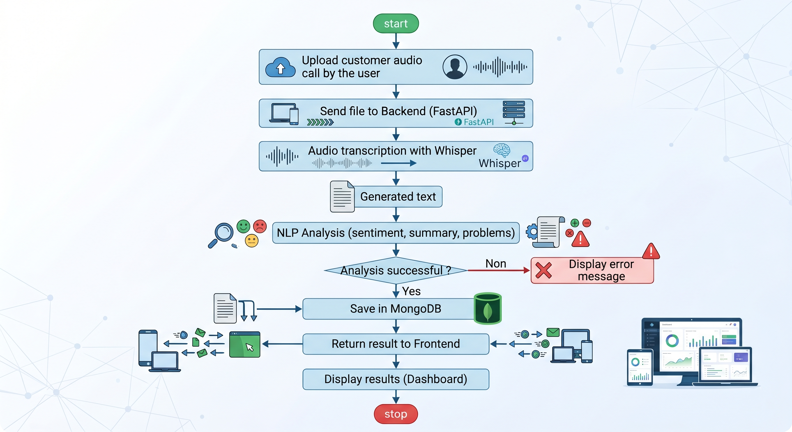
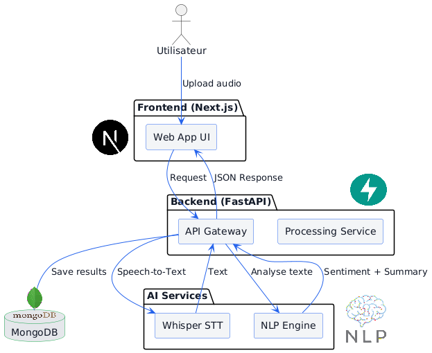
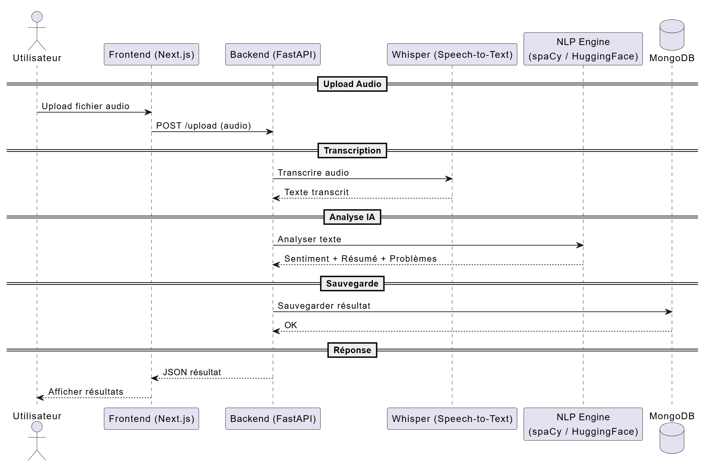

# AI Call Center Analytics 🇲🇦

**AI Call Center Analytics** est la première solution marocaine d'analyse intelligente pour les centres d'appels, spécialement optimisée pour comprendre et traiter le **Darija (arabe marocain)** et le français et autre langagues.

Ce projet automatise le traitement des flux audio bruts (enregistrements clients) pour les transformer en données structurées et exploitables par un manager (analyse de sentiment, détection des problèmes précis, suggestions de solutions).

---

## 🔄 Flux de Travail (Workflow)

Voici comment l'application gère un appel de bout en bout, de la réception du fichier audio jusqu'à sa transcription et son analyse IA complète :



---

## 🚀 Fonctionnalités Clés

- **Reconnaissance Vocale Multilingue (STT)** : Transcription précise du Darija phonétique, de l'arabe et du français mixte grâce à Whisper.
- **Analyse NLP Avancée (Llama 3.1 & Groq)** : Extraction intelligente du contexte (Sentiment, Problèmes réels, Solutions recommandées pour l'agent, Résumé fidèle).
- **Architecture Robustifiée (Anti-Hallucination)** : Utilisation du _Few-Shot Prompting_ pour garantir que l'IA renvoie toujours un format JSON strict, adapté aux besoins de l'interface.
- **Pipeline Cloud & Local Sync** : Stockage sécurisé des fichiers audio sur Supabase (S3) et persistance relationnelle asynchrone dans MongoDB (avec système _Upsert_ anti-doublons).

---

## 🏗️ Architecture Technique

L'application repose sur un écosystème moderne, asynchrone et hautement performant :

- **Backend** : FastAPI (Python 3.13) - Asynchrone, rapide et documenté nativement avec Swagger.
- **Gestionnaire de Dépendances** : Poetry.
- **Base de Données** : MongoDB (via le driver asynchrone `motor`).
- **Stockage Cloud** : Supabase Storage (S3 API).
- **Moteurs d'IA (Inférence Ultra-Rapide)** : API Groq (Whisper-large-v3 & Llama-3.1-8b-instant).

### Schéma de l'Architecture Logicielle

Le diagramme ci-dessous illustre l'interaction entre le serveur FastAPI, la base de données locale MongoDB, le stockage cloud Supabase et les services d'inférence IA :



### Pipeline de Données

1. **POST `/upload`** ➔ Reçoit l'audio ➔ Calcule la taille/type ➔ Upload sur Supabase.
2. **Transcription** ➔ Whisper convertit l'audio en texte brut.
3. **Analyse NLP** ➔ Llama analyse le texte et génère des insights structurés.
4. **MongoDB Store** ➔ Crée/Met à jour deux collections liées par clé étrangère : `calls` (fichiers/transcriptions) et `analyses` (insights IA).

Le diagramme de séquence suivant détaille la chronologie des requêtes asynchrones :



---

## 🛠️ Installation et Configuration

### 1. Prérequis

- Python 3.13+
- MongoDB installé en local (ou MongoDB Atlas)
- Un compte Supabase et un compte Groq Cloud

### 2. Clonage et Installation

```bash
git clone [https://github.com/yassinezadod/Call-Canter-AI.git](https://github.com/yassinezadod/Call-Canter-AI.git)
cd call-center-ai
poetry install

```

---

## 📺 Démo Vidéo du Projet

Découvrez le fonctionnement de l'application en action (Upload, Transcription Whisper, et Analyse NLP avec Llama 3.1) :

👉 [**Regarder la vidéo de démonstration sur Google Drive**](https://drive.google.com/file/d/1uEb_lF3vNQ8557vYxH5wqW5LZKLhBmNd/view)
